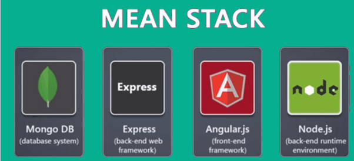

<h1 align="center">Health Overview Backend</h1>

 

   Architecture of Health Overview

# Description
Backend for the Health Overview project. 
 
 
This backend application is responsible of the following tasks
- Register a user, encrypt their password and store them in the Db
- Receive sensor data and store them in the Db
- Query data from the Db
- Create socketIO room for notification handling
- Store and distribute the front-end angular static website

The following technologies where used:
- MongoDb and Mongoose for database management and access
- Express for the rest Api server
- SocketIO for realtime notification service
- Heroku for the deployment

#

### Start db localy
start database
mongod --dbpath ~/Documents/local_prog/database/qoverview/data/db/