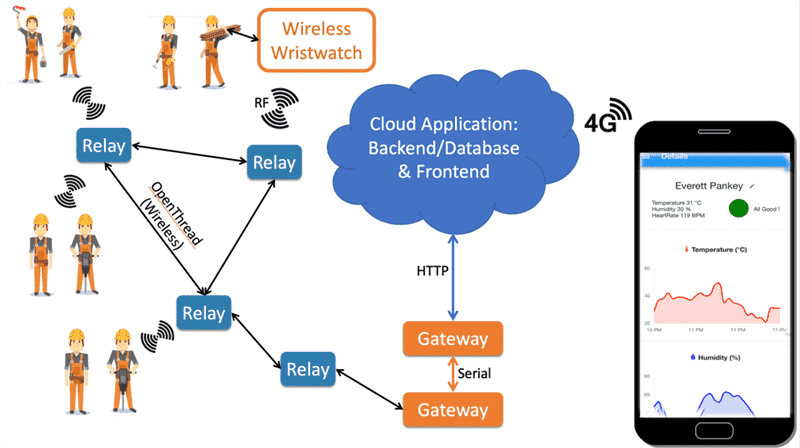
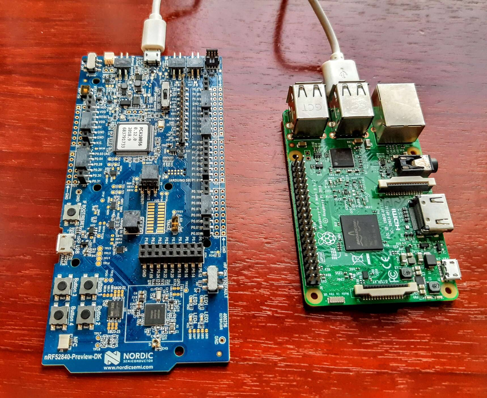
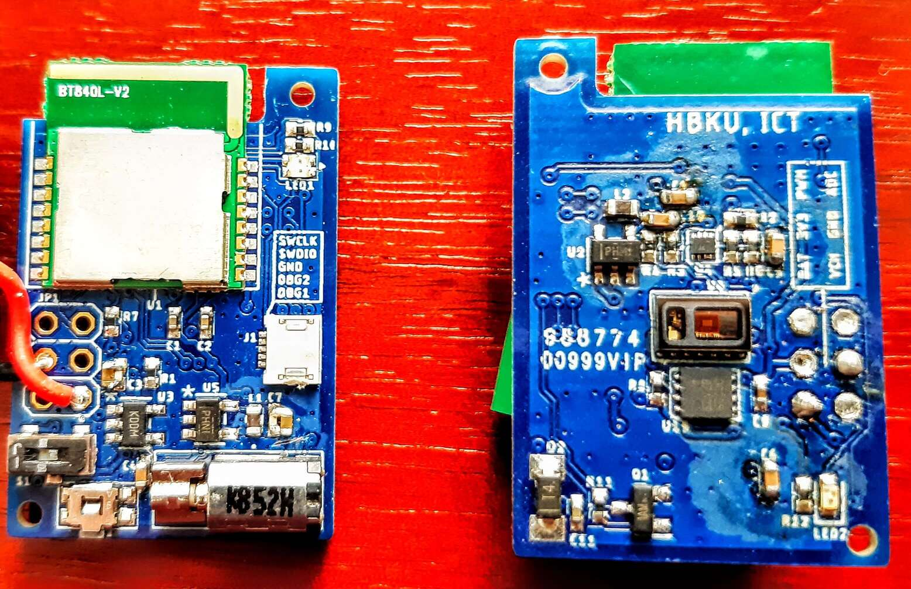

<h1 align="center">Health Overview Firmware</h1>

 
Health Overview Architecture

 

&nbsp;&nbsp;&nbsp;&nbsp;&nbsp;&nbsp;

 
Gateway system on the left. Wristwatch PCB on the right

 

# Description
This folder contains the code for the 3 differents firmware for the:
- Wristwatches
- Relays 
- Gateway

The wristwatches are embedded devices running on batteries that sample the heart rate and temperature before sending their data to the mesh network. The relays are responsible for well.. relaying the data to the gateway, whose role is to aggregate data and send it to the single board computer (raspberry pi here) for communication to the backend. 

 

# Wristwatches Firmware

 

# Relay Firmware
The relay's hardware consists of a Nordic nrf52 development board running on a powerbank. Its firmware allows for relaying the messages from the smartwatches to the gateways and vice versa. Relays are directly responsible for the range of the network and its latency. In order to physicaly position the relay optimally, a routine is triggered by a push button that indicates the strength of the signal to the gateway (packet loss counting).

 

# Gateway Firmware
The Gateway System's hardware is made of two components, a Nordic nrf52 development board and a Single Board Computer (Raspberry Pi). the Nordic dev board firmware's purpose is to receive and transmit messages from the Open Thread mesh network and relay them to the Single board computer. They communicate through UART. The firware here only apply to the Nordic dev board. The rapsberry pi is running a python application found <a href="https://github.com/pseudoincorrect/Health_overview/tree/master/Overview_gateway">here</a>.

 

# Unit Tests
Unit test are made with Unity and Ceedling.

 

# Build instructions
Please follow <a href="https://github.com/pseudoincorrect/Health_overview/blob/master/Overview_firmware/Build_instructions.txt">these instructions</a> to get started either on Segger Embedded Studio (SES) of on VScode. SES is definitely easier to set up here and yield a higher productivity (in my case). 

