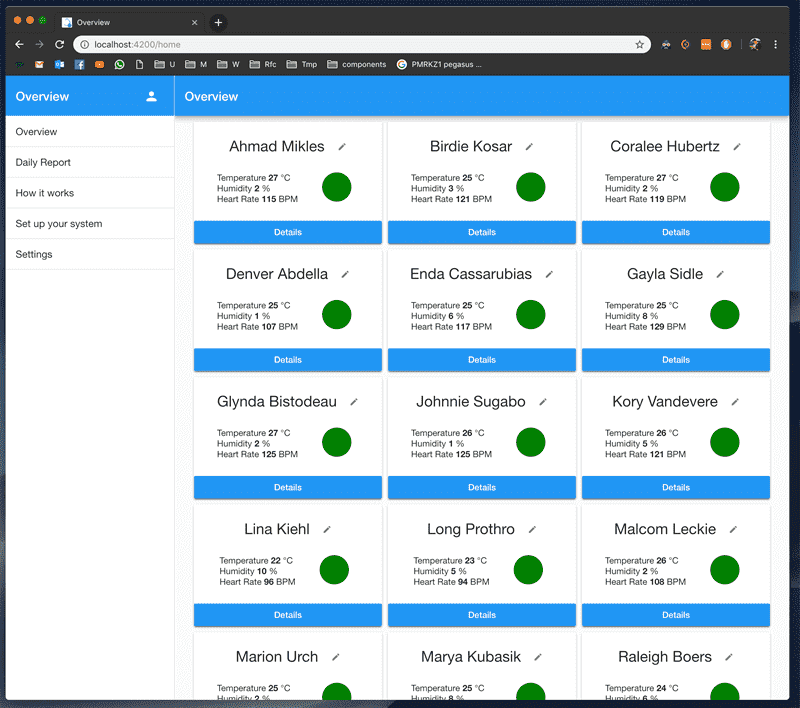
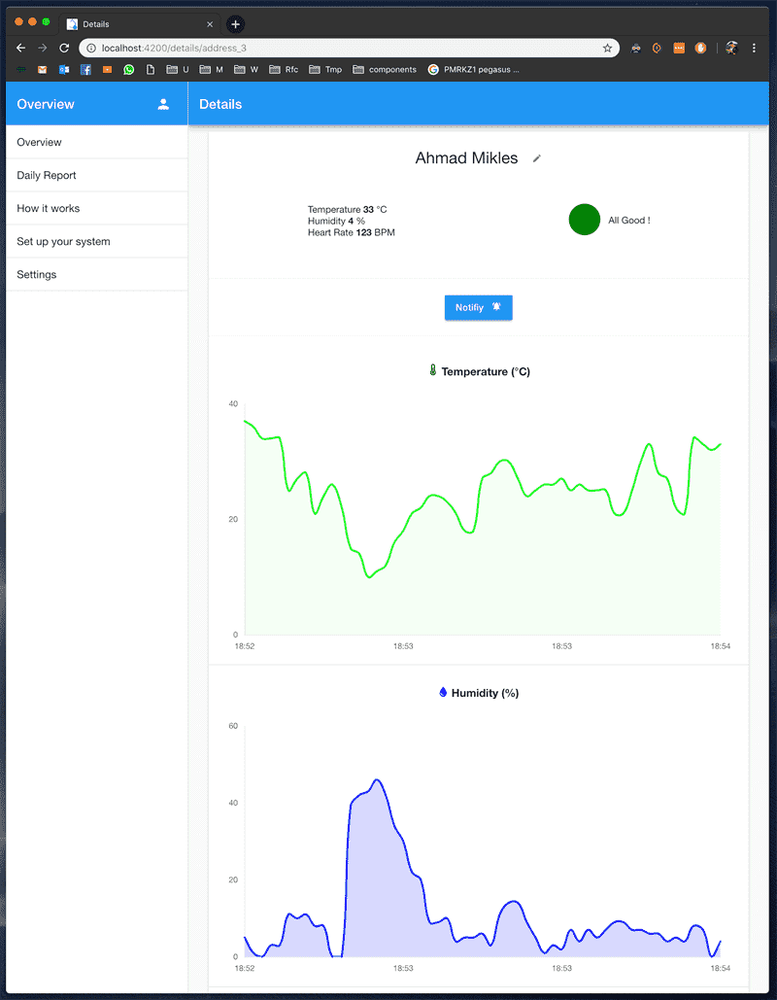

<h1 align="center">Health Overview Front end</h1>

&nbsp;&nbsp;&nbsp;&nbsp;&nbsp;&nbsp;

 
 Data from these screenshot are simulated to avoid sharing health data

# Description
Angular application for the Health Overview project.
 
The next iteration of this project is now using Flutter.
 
The following features are covered with this Web App:
- Login handling
- Daily summary of all the health status
- Display of all wristwatches on a condensed screen
- Display the detail of a single wristatch
- Modification of the info for each wristwatch (name, age, etc..)
- Realtime reception of notifications from wristwatches with SocketIO rooms
- Sending of notification to wristwatches
- Page presenting the system

 
 

This project was made with [ngX-Rocket](https://github.com/ngx-rocket/generator-ngx-rocket/).

