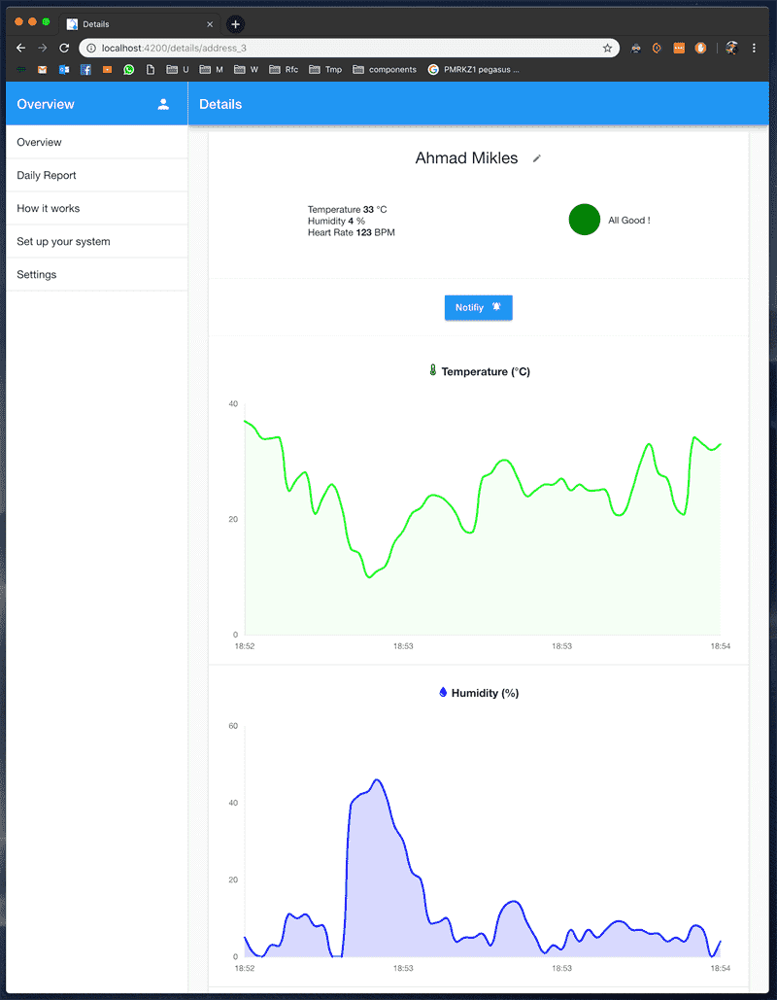
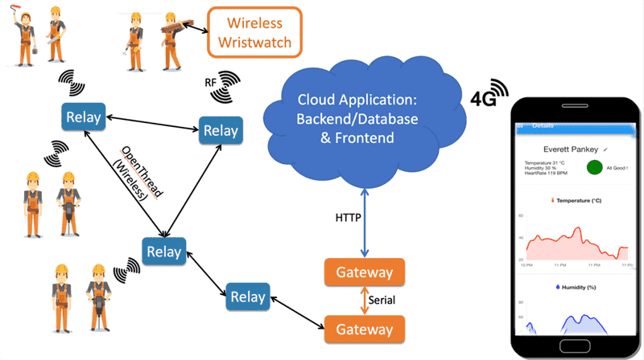
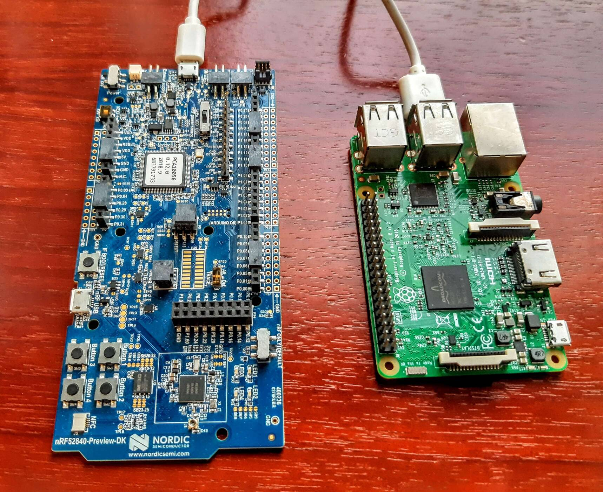
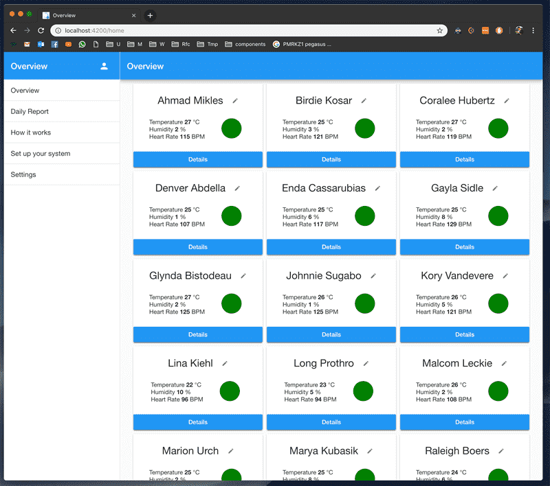

<h1 align="center">Health Overview</h1>

&nbsp;&nbsp;&nbsp;&nbsp;&nbsp;&nbsp;

 

# Description
The goal of Health Overview is to provide a Online (web) realtime overview of the health status of a group of individuals within a mesh RF network and send notifivations to users (watch-wearers and physicians) in case of an alarming health status, especially regarding dehydration. 
 
 
This system does not replace the examination of a physician and simply provides early health updates/warnings depending of vital signs, for later examination by a professional.
 
 

# Details
This project being a full IoT system stack, is split into 5 parts:
- Printed Circuit Board
- 3 Embedded Firmware (mesh nodes, mesh relays and mesh gateway)
- Python application for the gateway single board computer
- Backend application to be deployed on a cloud provider 
- Frontend Web application

 

## Disclamers
This project is not recommended for a new design starting point. We then moved to a LoraWan architecture for improved security and deployment ease. For an improved PCB design usable in a mesh network based on NRF52, the <a href="https://github.com/pseudoincorrect/smart_mask/tree/master/PCB">FlexySense project</a> is more recent and has been greatly improved. 
 
 
Also, being one of my "junior projects", its code needs improvement. Still, the demonstration was a success and all features were working properly. It enabled us to move on a next iteration with improved performances, reliability and security.
 
 
This project is kept as an archive (not maintened anymore), initialy on 5 differents private repositories, they have been merged for convenience and public access.
 
 

# Printed Circuit Board
The PCB has been designed with eagle on two layers. It includes a Nordic nrf52 module, temperature sensors, Heart-rate sensor, power supply/regulators, vibration motor, LEDs. for an improved design (but without heart rate sensor), please check the <a href="https://github.com/pseudoincorrect/smart_mask">FlexySense project</a>.

PCB Cad design files <a href="https://github.com/pseudoincorrect/Health_overview/tree/master/Overview_watch_pcb/Eagle/overview">here</a>.

 

&nbsp;&nbsp;&nbsp;&nbsp;&nbsp;&nbsp;

 
 (From left to right) Eagle design, Debug board for testing, Prototype Smartwatch board

 

# 3 Embedded Firmware: (1) mesh smartwatch, (2) mesh relays and (3) mesh gateway
Health Overview is a system partly based on OpenThread mesh network, implemented on NordiSemi devices (nrf52).
 
Vital signs Data where gathered on the smartmatches (1), then data packets where relayed by the relay nodes (2) to the gateway node (3) that is serving as bridge between the mesh network and the cloud application.
 
 

   Architecture of Health Overview

The wristwatch Overview_firmware/ folder contain the source code for the 3 systems (smartwatches, relays and gateway). each system has one folder for its specific code and share a common/ folder for system independant code.
 
More details <a href="https://github.com/pseudoincorrect/Health_overview/tree/master/Overview_firmware">here</a>.
 
 

# Python application for the gateway 
The gateway is the system that receive the data from the smartwatches and send them to the cloud application. Being a bidirection link, it can also send data from the could application to the smartwatches. the connection with cloud application is secured by a symetric key. 
 
 
The gateway is composed of 2 devices: a NRF52 development kit and a raspberry pi. 
- The NRF52 dev kit receive the data from the smartwaches and relay them to the raspberry py thanks to a serial connection. 
- The raspberry pi handle all the cloud related operations with a Python application.

More details <a href="https://github.com/pseudoincorrect/Health_overview/tree/master/Overview_gateway">here</a>.
 

   Health Overview Gateway (link between smartwatches and cloud application)

 

# Backend stack to be deployed on a cloud provider 

The backend takes care of user management, devices management and health data storage.
It follow the MEAN stack (MongoDB, Express, Angular, NodeJs). When the application was active, it was deployed on Heroku. We then moved to a dockerised application on the next iteration of this project.

More details <a href="https://github.com/pseudoincorrect/Health_overview/tree/master/Overview_backend">here</a>.

 

   Stack used for this project

 

# Frontend Web application
Data presentation was realized with an Angular single page application. Users could login and display the sensor of their group as well as displaying a detailed version of each smartwatch. Notification where displayed depending on the status of each sensor and notification could be sent to each wristwatch. The notification service was made with socketIo while all the data and login was made with HTTP.
 
 More details <a href="https://github.com/pseudoincorrect/Health_overview/tree/master/Overview_frontend">here</a>.

 

&nbsp;&nbsp;&nbsp;&nbsp;&nbsp;&nbsp;

 
 Data from these screenshot are simulated to avoid sharing health data

#